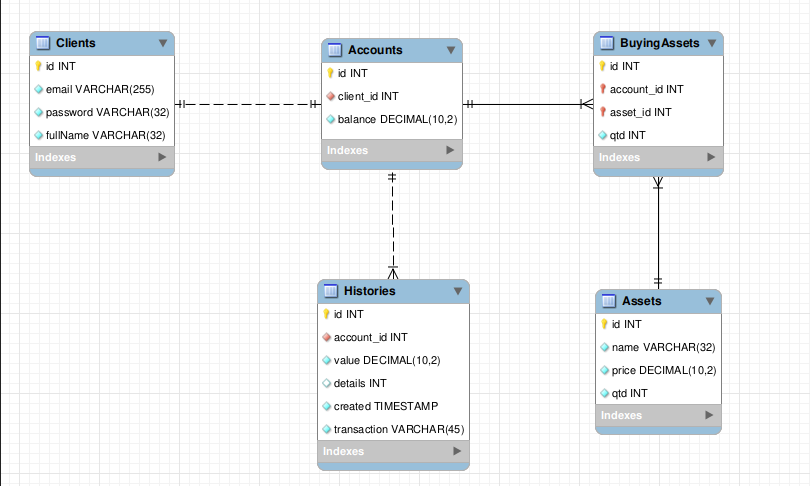

# Boas-vindas!

Esta é uma API que fornece ao cliente acesso aos ativos da corretora e a detalhes de sua conta.

Documentação da API : https://psel-xp-api.herokuapp.com/docs/#/

 

# Ferramentas utilizadas

<ul>
<li>Express</li>
<li>Sequelize</li>
<li>JWT</li>
<li>Swagger</li>
<li>Heroku</li>
<li>Mocha</li>
<li>Chai</li>
<li>Sinon</li>
</ul>

 

# Diagrama do banco de dados

# Orientações de como rodar o projeto
 ## 👉 Sem Docker
  > Após clonar o projeto, execute o comando `npm install`.
   
  > Renomeie o arquivo .env.example para .env e preencha as variáveis 
   
  > Execute os comandos `npx sequelize-cli db:create`, `npx sequelize-cli db:migrate` e `npx sequelize-cli db:seed:all`
   
  > Execute `npm start` para rodar a aplicação
  
  ## 👉 Com Docker
  > Após clonar o projeto, execute o comando `npm install`.
   
  > Execute `docker-compose up` 
   
  > Renomeie o arquivo `.env.example para` `.env` e preencha a variável `JWT_SECRET`
   
  > Abra o CLI do container api com o comando `docker exec -it api bash`
   
  > Execute os comandos `npx sequelize-cli db:create`, `npx sequelize-cli db:migrate` e `npx sequelize-cli db:seed:all`

# Testes

Foram implementados neste projeto testes unitários somente da camada service e das middlewares de validação.
 > Para rodar os testes, execute o comando `npm test`. Lembre-se que a aplicação deve estar rodando. <strong>Obs:</strong> Se estiver rodando a aplicação pelo docker, este comando também deve ser executado no CLI do container api.
   

